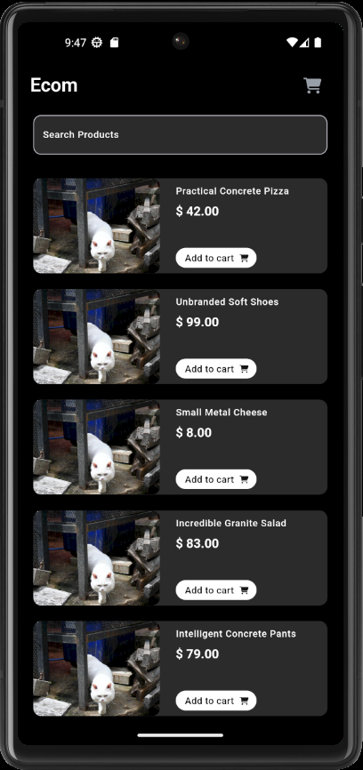
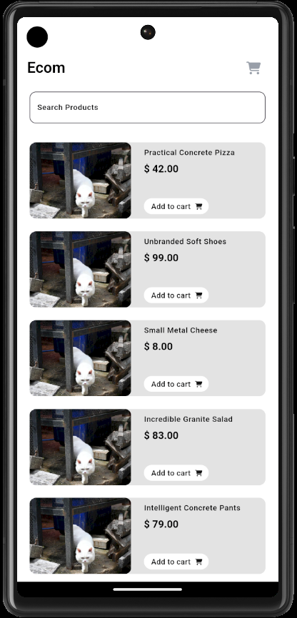

# Ecom app

A simple e-commerce application where users can browse products, add them to a cart, and proceed to checkout. Mock API service to fetch product data. BloC is used as the state management solution to manage the app's state (cart, product list, user data). Because we are using state management for the user data, I added another mock API service to fetch data of the user. This data can be changed when adding the shipping information as needed before the payment is done.

Light and dark theme is added, so that the user can choose the theme which is prefered. The splash screen is also changes according to the theme. The app logo and the splash screen logo is done using **Figma**.

## Features

- **Real-time Data**: Fetches product and user data using an external API.
- **Prouduct Search**: Products can be searched from the search products field.
- **Product Quantity Changer**: Product qunatities can be changed after the products are added to the cart and if the user presses the same product, the qunatity of the product changes without adding the same product to the cart. The qunatity can be changed in the order confirmation page.
- **Light and Dark Themes**: Toggle between light and dark modes for a personalized experience.
- **Deleting Products**: Press the trash button for the selected product in the my cart screen to remove the product. This feature is also available in the order confirmation screen.

## Images of the user interface.

**Dark Mode and Light Mode**

  
   

## Getting Started

This project is a starting point for a Ecom application.

A few resources to get you started if this is your first Flutter project:

- [Lab: Write your first Flutter app](https://docs.flutter.dev/get-started/codelab)
- [Cookbook: Useful Flutter samples](https://docs.flutter.dev/cookbook)

For help getting started with Flutter development, view the
[online documentation](https://docs.flutter.dev/), which offers tutorials,
samples, guidance on mobile development, and a full API reference.
